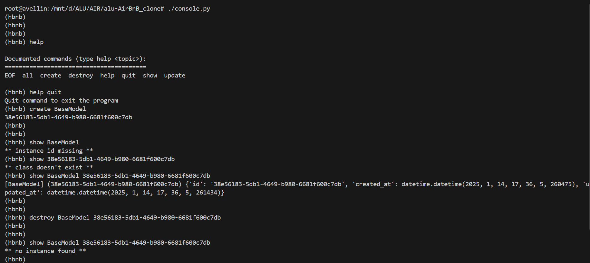

# AirBnB Clone

This project is a simplified clone of the AirBnB web application. It includes a command-line interface (CLI) for managing objects, a storage engine for persisting data, and a web static front-end.

## Table of Contents

- Project Overview
- Features
- Installation
- Usage
- File Structure
- Contributing
- License

## Project Overview

The AirBnB Clone project is a comprehensive project that aims to replicate the core functionalities of the AirBnB platform. It includes:

- A command interpreter to manage objects.
- A storage engine to handle data persistence.
- Unit tests to ensure code quality.
- A web static front-end to display data.

## Features

- **Command Interpreter**: Create, read, update, and delete objects via a command-line interface.
- **Storage Engine**: Serialize and deserialize objects to and from JSON files.
- **Unit Tests**: Comprehensive tests to ensure the reliability of the codebase.
- **Web Static Front-End**: HTML/CSS files to display data in a user-friendly format.

## Installation

To get started with the AirBnB Clone project, follow these steps:

1. Clone the repository:
    ```sh
    git clone https://github.com/your-username/airbnb-clone.git
    cd airbnb-clone
    ```
2. Enjoy the CLI clone of AirBnB!.
## Demo

### Command Interpreter

The command interpreter allows you to manage objects interactively. To start the interpreter, run:

```sh
./console.py
```

Available commands:
- `create <class>`: Creates a new instance of a class.
- `show <class> <id>`: Shows the string representation of an instance.
- `destroy <class> <id>`: Deletes an instance.
- 

all [<class>]

: Shows all instances, optionally filtered by class.
- `update <class> <id> <attribute> <value>`: Updates an instance attribute.

###Example

```sh
(hbnb) create User
(hbnb) show User <id>
(hbnb) update User <id> email "example@mail.com"
(hbnb) all User
(hbnb) destroy User <id>
```

## File Structure

```
├── AUTHORS
├── console.py
├── file.json
├── models/
│   ├── __init__.py
│   ├── amenity.py
│   ├── base_model.py
│   ├── city.py
│   ├── engine/
│   │   ├── __init__.py
│   │   └── file_storage.py
│   ├── place.py
│   ├── review.py
│   ├── state.py
│   └── user.py
├── README.md
├── tests/
│   ├── test_base_model.py
│   ├── test_base_model_dict.py
│   ├── test_models/
│   │   ├── test_amenity.py
│   │   ├── test_city.py
│   │   ├── test_engine/
│   │   │   ├── __init__.py
│   │   │   └── test_file_storage.py
│   │   ├── test_place.py
│   │   ├── test_review.py
│   │   ├── test_state.py
│   │   └── test_user.py
│   ├── test_save_reload_base_model.py
│   └── test_save_reload_user.py
└── web_static/
    ├── 0-index.html
    ├── 1-index.html
    ├── 2-index.html
    ├── 3-index.html
    ├── 4-index.html
    ├── 5-index.html
    ├── 6-index.html
    ├── 7-index.html
    ├── 8-index.html
    ├── images/
    ├── README.md
    └── styles/
```

## Contributing

Contributions are welcome! Please read the CONTRIBUTING.md file for guidelines on how to contribute to this project.

*This project is maintained by Esther Sessenou Adi and UTERAMAHORO Avellin Bonaparte.*
